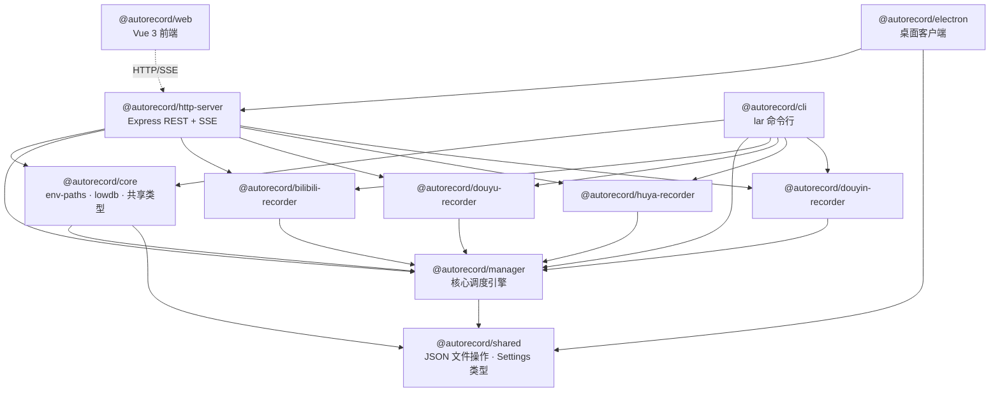

# LiveAutoRecord 系统架构文档

## 1. 概述

LiveAutoRecord（LAR）是一个多直播平台自动录制工具，支持**斗鱼、B站、虎牙、抖音**四个平台。项目提供三种使用方式：

| 使用方式                | 入口包                    | 适用场景                               |
| ----------------------- | ------------------------- | -------------------------------------- |
| **Electron 桌面客户端** | `@autorecord/electron`    | 个人用户，GUI 操作                     |
| **HTTP Server 服务端**  | `@autorecord/http-server` | 服务器部署，配合 Web 前端远程管理      |
| **CLI 命令行工具**      | `@autorecord/cli`         | 脚本自动化、AI Agent 集成、无 GUI 环境 |

三种方式共享同一数据目录（由 `env-paths('live-auto-record')` 决定），因此**同一时间只能运行一个实例**，否则会产生数据库写入冲突。

---

## 2. Monorepo 包关系图

### 2.1 包一览

项目使用 **pnpm 10 Workspaces + Turborepo**（独立版本号，`@changesets/cli` 管理发布）管理，共 11 个包：

| 包名                            | 角色                                                                         | 发布到 npm |
| ------------------------------- | ---------------------------------------------------------------------------- | ---------- |
| `@autorecord/shared`            | 内部共享工具：Settings 类型、JSON 文件读写（Steno 原子写入）                 | 私有       |
| `@autorecord/manager`           | 核心调度引擎：Recorder/RecorderProvider 接口定义、检查循环、FFmpeg 集成      | 公开       |
| `@autorecord/core`              | CLI 和 Server 共享的核心模块：env-paths 路径、lowdb 封装、类型定义、工具函数 | 私有       |
| `@autorecord/bilibili-recorder` | B站平台录制插件                                                              | 公开       |
| `@autorecord/douyu-recorder`    | 斗鱼平台录制插件                                                             | 公开       |
| `@autorecord/huya-recorder`     | 虎牙平台录制插件                                                             | 公开       |
| `@autorecord/douyin-recorder`   | 抖音平台录制插件                                                             | 公开       |
| `@autorecord/http-server`       | Express REST API + SSE 实时推送                                              | 私有       |
| `@autorecord/cli`               | CLI 工具（`lar` 命令），直接操作 manager + DB                                | 私有       |
| `@autorecord/web`               | Vue 3 + Vite + Vuetify + Tailwind 前端                                       | 私有       |
| `@autorecord/electron`          | Electron 桌面客户端，整合 http-server 与 web                                 | 私有       |

### 2.2 依赖关系图



> 箭头方向表示"依赖于"。`web` 与 `http-server` 之间是运行时 HTTP 通信，非编译时依赖。

### 2.3 构建顺序

由 Turborepo 自动按拓扑排序，`turbo.json` 中 `"^build"` 声明依赖。等效顺序：

```
shared --> manager --> core + 4 recorders (并行) --> cli + http-server (并行) --> electron
```

第二次构建因 FULL TURBO 缓存命中，可在毫秒级完成。

---

## 3. 核心概念

### 3.1 RecorderProvider 插件系统

每个直播平台实现 `RecorderProvider<E>` 接口，通过 `createRecorderManager({ providers: [...] })` 注册到 Manager。

**接口定义**（`packages/manager/src/manager.ts`）：

```typescript
interface RecorderProvider<E> {
  id: string // Provider 唯一标识，如 "Bilibili"
  name: string // 显示名称
  siteURL: string // 平台网址

  matchURL(channelURL: string): boolean
  resolveChannelInfoFromURL(channelURL: string): Promise<{ id; title; owner } | null>
  createRecorder(opts): Recorder<E>
  fromJSON(json): Recorder<E>
  setFFMPEGOutputArgs(args: string[]): void

  // 可选鉴权接口
  authFields?: ProviderAuthField[] // 鉴权字段声明
  authFlow?: ProviderAuthFlow // 浏览器登录流程声明
  setAuth?(config: Record<string, string>): void // 注入鉴权配置
  checkAuth?(): Promise<ProviderAuthStatus> // 验证鉴权状态
}
```

**4 个平台实现**：

| Provider | 文件                                      | URL 匹配规则                     |
| -------- | ----------------------------------------- | -------------------------------- |
| Bilibili | `packages/bilibili-recorder/src/index.ts` | `bilibili.com`                   |
| Douyu    | `packages/douyu-recorder/src/index.ts`    | `douyu.com`                      |
| Huya     | `packages/huya-recorder/src/index.ts`     | `huya.com`                       |
| Douyin   | `packages/douyin-recorder/src/index.ts`   | `douyin.com` / `live.douyin.com` |

**实现模式**（以 B站为例）：

1. `createRecorder()` 创建 Recorder 实例，用 `Proxy` 包裹以拦截属性变更并触发 `Updated` 事件
2. `checkLiveStatusAndRecord()` 通过 `singleton()` 包装，确保同一时间只有一个检查/录制流程运行
3. `getInfo()` 调用平台 API 获取直播状态
4. `getStream()` 获取直播流地址，支持画质优先级和 CDN 源优先级
5. 通过平台弹幕协议（如 B站的 `blive-message-listener`）收集弹幕和礼物消息

### 3.2 Recorder 状态机

**接口定义**（`packages/manager/src/recorder.ts`）：

```
                  checkLiveStatusAndRecord()
                  检测到直播中
         ┌──────────────────────────────────┐
         │                                  v
       idle ◄──────────────── stopping-record ◄────── recording
              stop() 完成后                       调用 stop()
              自动回到 idle                        或流结束
```

三个状态：

- **`idle`** — 空闲，等待检查
- **`recording`** — 正在录制，持有 `recordHandle`
- **`stopping-record`** — 正在停止录制（发送 SIGINT 给 FFmpeg、关闭弹幕连接、刷写元数据）

**Recorder 核心属性**：

```typescript
interface Recorder<E> extends Emitter<Events>, RecorderCreateOpts<E> {
  id: string // UUID
  state: RecorderState // 当前状态
  channelId: string // 频道/房间号
  quality: Quality // lowest | low | medium | high | highest
  streamPriorities: string[] // 流优先级（如 flv, hls）
  sourcePriorities: string[] // CDN 源优先级
  remarks?: string // 备注（主播名等）
  disableAutoCheck: boolean // 是否跳过自动检查
  availableStreams: string[] // 可用的流列表（运行时填充）
  availableSources: string[] // 可用的源列表（运行时填充）
  recordHandle?: RecordHandle // 当前录制句柄

  checkLiveStatusAndRecord(opts): Promise<RecordHandle | null>
  toJSON(): SerializedRecorder<E> // 序列化用于持久化
}
```

**RecordHandle**（`packages/manager/src/recorder.ts`）：

```typescript
interface RecordHandle {
  id: string // 此次录制的 UUID
  stream: string // 使用的流名称
  source: string // 使用的源（CDN）
  url: string // 直播流 URL
  ffmpegArgs?: string[]
  savePath: string // 录制文件保存路径
  stop(reason?: string): Promise<void>
}
```

### 3.3 RecorderManager 调度

**接口定义**（`packages/manager/src/manager.ts`）：

RecorderManager 是整个系统的核心调度器，负责管理所有 Recorder 实例和自动检查循环。

**关键特性**：

1. **3 并发检查线程** — `multiThreadCheck()` 函数创建 3 个并行工作线程，从待检查队列中逐个取出 Recorder 并调用 `checkLiveStatusAndRecord()`

2. **自动检查循环** — `startCheckLoop()` 启动定时循环，每次循环完成后等待 `autoCheckInterval`（默认 1000ms）再进入下一轮

3. **Proxy 配置拦截** — Manager 对象被 `Proxy` 包裹，对可配置属性（`savePathRule`、`autoCheckInterval`、`ffmpegOutputArgs` 等）的写入会自动：
   - 触发 `Updated` 事件（上层监听此事件将配置持久化到 `manager.json`）
   - 若修改 `ffmpegOutputArgs`，同步更新所有 Provider 的 FFmpeg 参数

4. **保存路径模板** — `genSavePathFromRule()` 支持以下模板变量：
   ```
   {platform}   → Provider 名称（如 Bilibili）
   {channelId}  → 频道号
   {owner}      → 主播名
   {title}      → 直播标题
   {year} {month} {date} {hour} {min} {sec} → 时间字段
   {remarks}    → 备注
   ```
   默认规则：`{dataPath}/{platform}/{owner}/{year}-{month}-{date} {hour}-{min}-{sec} {title}.mp4`

**事件列表**：

| 事件               | 载荷                                  | 说明                       |
| ------------------ | ------------------------------------- | -------------------------- |
| `RecordStart`      | `{ recorder, recordHandle }`          | 开始录制                   |
| `RecordStop`       | `{ recorder, recordHandle, reason? }` | 录制停止                   |
| `RecorderUpdated`  | `{ recorder, keys[] }`                | Recorder 属性变更          |
| `RecorderAdded`    | `recorder`                            | 添加新 Recorder            |
| `RecorderRemoved`  | `recorder`                            | 移除 Recorder              |
| `RecorderDebugLog` | `{ recorder, type, text }`            | 调试日志（含 FFmpeg 输出） |
| `Updated`          | `ConfigurableProp[]`                  | Manager 自身配置变更       |
| `error`            | `{ source, err }`                     | 错误事件                   |

### 3.4 FFmpeg 录制流程

录制流程在各平台 Recorder 的 `checkLiveStatusAndRecord()` 方法中实现。以 B站为例（`packages/bilibili-recorder/src/index.ts`）：

```
┌─────────────┐     ┌──────────────┐     ┌───────────────┐
│ 1. 检查直播  │────>│ 2. 获取流地址 │────>│ 3. 创建目录   │
│ getInfo()    │     │ getStream()   │     │ ensureFolder() │
│ living?      │     │ quality 选择  │     │ 创建元数据文件 │
└─────────────┘     └──────────────┘     └───────────────┘
                                                │
                ┌───────────────────────────────┘
                v
┌──────────────────┐     ┌────────────────┐     ┌──────────────┐
│ 4. 启动 FFmpeg    │────>│ 5. 启动弹幕收集 │────>│ 6. 监控录制   │
│ fluent-ffmpeg     │     │ 平台协议连接    │     │ 帧更新检测    │
│ -c copy           │     │ 弹幕/礼物写入   │     │ 10s 超时检测  │
│ -movflags frag_kf │     │ extraData JSON  │     │ 无效流检测    │
└──────────────────┘     └────────────────┘     └──────────────┘
                                                       │
                                                       v
                                                ┌──────────────┐
                                                │ 7. 停止录制   │
                                                │ SIGINT → FFmpeg│
                                                │ 关闭弹幕连接  │
                                                │ flush 元数据  │
                                                │ state → idle  │
                                                └──────────────┘
```

**FFmpeg 默认输出参数**：

```
-c copy -movflags frag_keyframe -min_frag_duration 60000000
```

- `-c copy`：直接复制流，不重新编码
- `-movflags frag_keyframe`：FragmentMP4 格式，支持边录边播，具有抗损坏能力
- `-min_frag_duration 60000000`：最小分段时长 60s，减少 moof boxes 数量以加速浏览器加载

**流选择逻辑**：按 `quality` → `streamPriorities` → `sourcePriorities` 三级优先级选择最佳流。

**健壮性措施**：

- `createInvalidStreamChecker()`：检测帧数连续 10 次无变化则判定为无效流
- `createTimeoutChecker()`：10 秒无 FFmpeg stderr 输出则判定连接卡顿
- HTTP 404 直接判定流无效

---

## 4. 数据层

### 4.1 数据目录结构

由 `env-paths('live-auto-record', { suffix: '' })` 决定路径（`packages/core/src/env.ts`）：

| 平台    | config 路径                              | data 路径                                        |
| ------- | ---------------------------------------- | ------------------------------------------------ |
| Windows | `%APPDATA%/live-auto-record/Config`      | `%APPDATA%/live-auto-record/Data`                |
| Linux   | `~/.config/live-auto-record`             | `~/.local/share/live-auto-record`                |
| macOS   | `~/Library/Preferences/live-auto-record` | `~/Library/Application Support/live-auto-record` |

```
{config}/
  ├── manager.json        # Manager 配置
  └── settings.json       # 应用设置

{data}/
  ├── data.json           # lowdb 数据库（recorders + records 表）
  └── {platform}/         # 录制文件按平台/主播/时间组织
      └── {owner}/
          ├── 2025-01-01 20-00-00 直播标题.mp4    # 录制视频
          └── 2025-01-01 20-00-00 直播标题.json   # 录制元数据
```

### 4.2 manager.json

Manager 配置文件，由 Proxy 拦截属性变更时自动写入。

**关键源文件**：`apps/http-server/src/manager.ts`、`apps/cli/src/core/manager-init.ts`

```typescript
interface ManagerConfig {
  savePathRule: string // 保存路径模板
  autoRemoveSystemReservedChars: boolean // 自动移除系统保留字符（Windows）
  autoCheckLiveStatusAndRecord: boolean // 是否启用自动检查
  autoCheckInterval: number // 检查间隔（ms）
  ffmpegOutputArgs: string // FFmpeg 输出参数
  providerAuthConfigs?: Record<string, Record<string, string>> // 各 Provider 的鉴权配置
}
```

`providerAuthConfigs` 存储各平台的鉴权凭据（如 B站 Cookie），应用启动时自动加载并注入到对应 Provider。

### 4.3 data.json（lowdb 数据库）

使用 lowdb（JSON 文件数据库）存储运行时数据。整个文件加载到内存，通过异步节流（`asyncThrottle`，1s 间隔）写回磁盘。

**关键源文件**：`packages/core/src/lowdb.ts`、`packages/core/src/types.ts`

```typescript
interface DatabaseSchema {
  recorders: RecorderModel[] // 录制器列表
  records: RecordModel[] // 录制记录列表
  nextRecorderId: number // 自增 ID 计数器
}

interface RecorderModel {
  // 包含 SerializedRecorder 的所有字段 + RecorderExtra
  id: string
  providerId: string
  channelId: string
  quality: Quality
  streamPriorities: string[]
  sourcePriorities: string[]
  remarks?: string
  disableAutoCheck?: boolean
  extra: { createTimestamp: number } // RecorderExtra
}

interface RecordModel {
  id: string // 录制 UUID
  recorderId: string // 关联的 Recorder ID
  savePath: string // 文件保存路径
  startTimestamp: number // 开始时间戳
  stopTimestamp?: number // 结束时间戳
  stopReason?: string // 停止原因
}
```

### 4.4 录制元数据 JSON

每次录制生成独立的 JSON 文件（与视频文件同名，扩展名为 `.json`），用于存储弹幕和礼物消息。

**关键源文件**：`packages/manager/src/record_extra_data_controller.ts`

```typescript
interface RecordExtraData {
  meta: {
    title?: string
    recordStartTimestamp: number
    recordStopTimestamp?: number
    ffmpegArgs?: string[]
  }
  messages: Message[] // 按时间戳排序的弹幕/礼物消息
}

type Message = Comment | GiveGift
```

通过 `RecordExtraDataController` 控制写入，使用 30s 异步节流防止频繁 I/O。录制停止时调用 `flush()` 确保数据完整写入。

### 4.5 settings.json

应用级设置（主要用于 Electron 和 HTTP Server 模式）。

**关键源文件**：`packages/shared/src/index.ts`

```typescript
interface Settings {
  notExitOnAllWindowsClosed: boolean // 关闭所有窗口时不退出
  noticeOnRecordStart: boolean // 录制开始时系统通知
  noticeFormat?: string // 通知格式
  debugMode?: boolean // 调试模式（写 FFmpeg 日志文件）
  autoGenerateSRTOnRecordStop?: boolean // 录制结束后自动生成 SRT 字幕
  autoRemoveRecordWhenTinySize?: boolean // 自动删除空录制文件
  locale?: string // 语言
  sortMode?: string // 排序模式
}
```

---

## 5. 通信架构

三种使用方式对 Manager 的访问路径不同：

```
┌─────────────────────────────────────────────────────────────────┐
│                        共享数据目录                               │
│  manager.json · data.json · settings.json · 录制文件 + 元数据     │
└─────────────────┬────────────────────┬─────────────────┬────────┘
                  │                    │                 │
         ┌────────┴────────┐  ┌────────┴────────┐  ┌────┴───────────┐
         │  HTTP Server 模式 │  │    CLI 模式     │  │  Electron 模式  │
         └────────┬────────┘  └────────┬────────┘  └────┬───────────┘
                  │                    │                 │
                  v                    v                 v
```

### 5.1 HTTP Server 模式

**关键源文件**：`apps/http-server/src/index.ts`、`apps/http-server/src/routes/`

```
┌──────────┐   HTTP REST    ┌──────────────┐   直接调用    ┌──────────────┐
│  Web 前端 │ ◄────────────> │  Express API  │ ──────────> │  Manager     │
│  (Vue 3)  │   /api/*       │  :8085        │              │  + Providers │
│           │                │               │              │  + lowdb     │
│  Axios    │   SSE          │  SSE 推送      │ <────事件──── │              │
│  RxJS     │ ◄──────────── │  /api/events  │              │              │
└──────────┘                └──────────────┘              └──────────────┘
```

**REST API 路由**（`apps/http-server/src/routes/index.ts`）：

| 路由模块   | 功能                                           |
| ---------- | ---------------------------------------------- |
| `recorder` | Recorder CRUD（增删改查）                      |
| `record`   | 录制记录查询                                   |
| `manager`  | Manager 配置读写、启停检查循环                 |
| `event`    | SSE 事件流 (`GET /api/events`)                 |
| `setting`  | 应用设置读写                                   |
| `logger`   | 日志级别控制                                   |
| `provider` | Provider 鉴权管理（查看/设置/浏览器登录/清除） |

**SSE 事件推送**（`apps/http-server/src/routes/event.ts`）：

SSE 将 Manager 的事件广播给所有连接的客户端，事件类型包括：

- `update_recorder` — Recorder 属性变更（同 tick 防抖）
- `add_recorder` — 新增 Recorder
- `remove_recorder` — 移除 Recorder
- `record_start` — 开始录制

### 5.2 CLI 模式

**关键源文件**：`apps/cli/src/bin.ts`、`apps/cli/src/core/manager-init.ts`

```
┌──────────────┐   直接导入    ┌──────────────┐
│  lar 命令行   │ ──────────> │  Manager     │
│  commander    │              │  + Providers │
│  consola      │              │  + lowdb     │
│               │ ◄────事件──── │              │
└──────────────┘              └──────────────┘
```

CLI 直接导入 `@autorecord/manager` 和 4 个 Provider，**无 HTTP 层**。通过 `@autorecord/core` 共享 env-paths、lowdb、类型定义等模块，与 HTTP Server 使用相同的数据目录和数据库格式。

**CLI 命令列表**（`apps/cli/src/bin.ts`）：

| 命令                   | 功能                        | 阶段    |
| ---------------------- | --------------------------- | ------- |
| `resolve <url>`        | 解析直播 URL，获取频道信息  | Phase 1 |
| `list`                 | 列出所有 Recorder           | Phase 1 |
| `add <url>`            | 添加新 Recorder             | Phase 1 |
| `remove <id>`          | 移除 Recorder               | Phase 1 |
| `status [id]`          | 查看 Recorder 状态          | Phase 2 |
| `start <id>`           | 手动启动录制                | Phase 2 |
| `stop <id>`            | 停止录制                    | Phase 2 |
| `check [id]`           | 检查直播状态并录制          | Phase 2 |
| `watch`                | 守护模式：持续监控和录制    | Phase 3 |
| `config [key] [value]` | 读写 Manager 配置           | Phase 3 |
| `records`              | 查看录制历史                | Phase 3 |
| `auth`                 | 管理平台鉴权（Cookie 登录） | Phase 3 |

所有命令支持 `--json` 全局开关，输出结构化 JSON，方便 AI Agent 解析。

**冲突检测**：`watch` 命令启动前会检测 HTTP Server 是否在运行（端口 8085），避免并发写入同一数据库。

### 5.3 Electron 模式

**关键源文件**：`apps/electron/src/index.ts`

```
┌──────────────────────────────────────────────────┐
│                  Electron 进程                     │
│                                                    │
│  ┌────────────┐      ┌─────────────────────────┐  │
│  │ Main 进程   │      │ Renderer 进程（Web 前端）  │  │
│  │             │      │                          │  │
│  │ startServer │      │  Vue 3 + Vuetify         │  │
│  │ (:8085)     │◄────>│  Axios → localhost:8085  │  │
│  │             │      │  RxJS SSE 事件流          │  │
│  │ 系统托盘    │      │                          │  │
│  │ 单实例锁    │      │  DPlayer 视频播放          │  │
│  └────────────┘      └─────────────────────────┘  │
│                                                    │
│  ffmpeg-static 提供捆绑的 FFmpeg 二进制              │
└──────────────────────────────────────────────────┘
```

Electron 的 Main 进程通过 `startServer()` 在 `localhost:8085` 启动完整的 HTTP Server，Renderer 进程加载 Web 前端，通过 HTTP 与内嵌 Server 通信。

**Electron 特性**：

- **单实例锁**：`app.requestSingleInstanceLock()` 防止多开
- **系统托盘**：支持最小化到托盘，右键菜单（显示/退出）
- **FFmpeg 路径处理**：asar 模式下需使用解包路径（`.asar.unpacked`）
- **electron-vite**：三段构建（main、preload、renderer）
- **窗口管理**：非内部页面自动转交系统浏览器打开

---

## 6. Provider 鉴权架构

### 6.1 概述

Provider 鉴权系统允许为每个直播平台配置登录凭据（如 Cookie），以获取更高画质的直播流。鉴权配置在 Provider 级别，同一平台的所有录制器共享一份凭据。

当前已实现 B站鉴权（Cookie 方式），其他平台可按需扩展。

### 6.2 鉴权数据流

```
┌──────────────────────────────────────────────────────────────────┐
│                        用户设置鉴权                                │
│                                                                    │
│  ┌─────────────┐  ┌─────────────┐  ┌─────────────────────────┐   │
│  │ Web UI 设置  │  │ CLI auth set│  │ 浏览器登录               │   │
│  │ (粘贴 Cookie)│  │ --cookie    │  │ (Playwright/BrowserWindow)│   │
│  └──────┬──────┘  └──────┬──────┘  └───────────┬─────────────┘   │
│         └────────────────┼─────────────────────┘                  │
│                          v                                         │
│                ┌─────────────────┐                                 │
│                │ provider.setAuth│ ─── 注入到 API 层（如 Axios 拦截器）│
│                └────────┬────────┘                                 │
│                         v                                          │
│              ┌──────────────────┐                                  │
│              │ 持久化到          │                                  │
│              │ manager.json     │                                  │
│              │ providerAuthConfigs│                                │
│              └──────────────────┘                                  │
└──────────────────────────────────────────────────────────────────┘

┌──────────────────────────────────────────────────────────────────┐
│                        应用启动加载                                │
│                                                                    │
│  manager.json ──> initRecorderManager() ──> provider.setAuth()    │
│                                              (每个有配置的 Provider) │
└──────────────────────────────────────────────────────────────────┘

┌──────────────────────────────────────────────────────────────────┐
│                        录制时使用                                  │
│                                                                    │
│  API 请求 ──> Axios 拦截器自动注入 Cookie header                    │
│  FFmpeg   ──> -headers "Cookie: ..." 参数注入                      │
└──────────────────────────────────────────────────────────────────┘
```

### 6.3 浏览器登录的依赖注入

浏览器登录通过 `ServerOpts.executeAuthFlow` 回调实现跨平台支持：

| 环境                 | 实现方式            | 源文件                              |
| -------------------- | ------------------- | ----------------------------------- |
| Electron             | `BrowserWindow`     | `apps/electron/src/index.ts`        |
| HTTP Server 独立运行 | Playwright Chromium | `apps/http-server/src/auth_flow.ts` |
| CLI                  | Playwright Chromium | `apps/cli/src/core/auth-flow.ts`    |

Provider 只需声明 `authFlow`（loginURL + checkLoginResult 纯函数），具体的浏览器启动和 Cookie 轮询由外部执行器实现。

### 6.4 Electron 浏览器登录测试计划

1. 启动 Electron 客户端，进入设置页面
2. 在"平台鉴权"区域找到 B站（Bilibili）
3. 点击"浏览器登录"按钮
4. 确认弹出 `BrowserWindow` 登录窗口，加载 `passport.bilibili.com/login`
5. 使用手机扫码或输入账号密码登录
6. 确认登录成功后窗口自动关闭
7. 确认状态芯片显示"已登录: 用户名"
8. 添加一个 B站直播间，设置画质为 highest
9. 启动录制，确认获取到原画直播流
10. 关闭并重新打开 Electron，确认鉴权状态仍然保持

### 6.5 手动 Cookie 测试计划

1. 从浏览器开发者工具复制 B站登录 Cookie（至少包含 `SESSDATA`）
2. 在 Web UI 设置页面粘贴 Cookie 到文本框，点击"保存"
3. 确认状态芯片显示"已登录: 用户名"
4. 或通过 CLI：`lar auth set Bilibili --cookie "SESSDATA=xxx; bili_jct=xxx"`
5. 验证：`lar auth list --json` 应显示 `isAuthenticated: true`
6. 添加 B站直播间录制器，确认 `availableStreams` 包含原画选项
7. 启动录制，检查 FFmpeg 命令行参数中是否包含 `Cookie:` header

---

## 7. 关键工具函数

### manager 包（`packages/manager/src/utils.ts`）

| 函数                      | 说明                                                                     |
| ------------------------- | ------------------------------------------------------------------------ |
| `asyncThrottle(fn, wait)` | 异步节流：正在执行时新调用被推迟，支持 `immediateRunWhenEndOfDefer` 选项 |

### core 包（`packages/core/src/utils.ts`）

| 函数                                   | 说明                                   |
| -------------------------------------- | -------------------------------------- |
| `assert(assertion, msg)`               | 断言函数，用于类型守卫                 |
| `pick(object, ...props)`               | 轻量级 pick，替代 lodash/ramda 依赖    |
| `ensureFileFolderExists(filePath)`     | 确保文件所在目录存在                   |
| `readJSONFileSync(path, defaultValue)` | 同步读取 JSON 文件，不存在则返回默认值 |
| `writeJSONFileSync(path, json)`        | 同步写入 JSON 文件（自动创建目录）     |

### bilibili-recorder 包中的通用模式

| 函数                                    | 说明                                                                |
| --------------------------------------- | ------------------------------------------------------------------- |
| `singleton(fn)`                         | 确保异步函数同时只有一个实例运行（在 `@autorecord/manager` 中导出） |
| `createTimeoutChecker(onTimeout, time)` | 超时检测器，每次 `update()` 重置计时器                              |
| `createInvalidStreamChecker()`          | 通过 FFmpeg stderr 输出检测无效流                                   |

---

## 8. 技术栈总结

| 层级     | 技术                                                                     |
| -------- | ------------------------------------------------------------------------ |
| 运行时   | Node.js + TypeScript 5.8+                                                |
| 构建     | tsup (ESM + CJS 双输出)                                                  |
| 桌面     | Electron 40 + electron-vite 5                                            |
| 后端     | Express 5 + lowdb + SSE                                                  |
| 前端     | Vue 3.5 + Vite 7 + Vuetify 3.11 + Tailwind CSS 4 + Pinia 3 + vue-i18n 11 |
| CLI      | commander 14 + consola 3 + console-table-printer                         |
| 录制     | fluent-ffmpeg + ffmpeg-static                                            |
| HTTP     | axios 1.x                                                                |
| 事件     | mitt (轻量级 EventEmitter)                                               |
| 持久化   | JSON 文件 (Steno 原子写入)                                               |
| Monorepo | pnpm 10 Workspaces + Turborepo + @changesets/cli                         |
